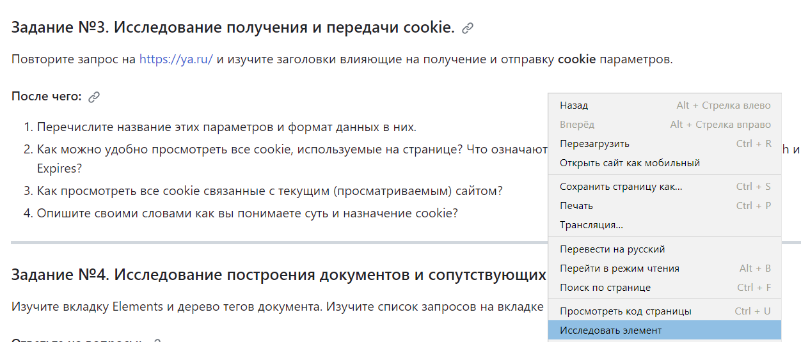
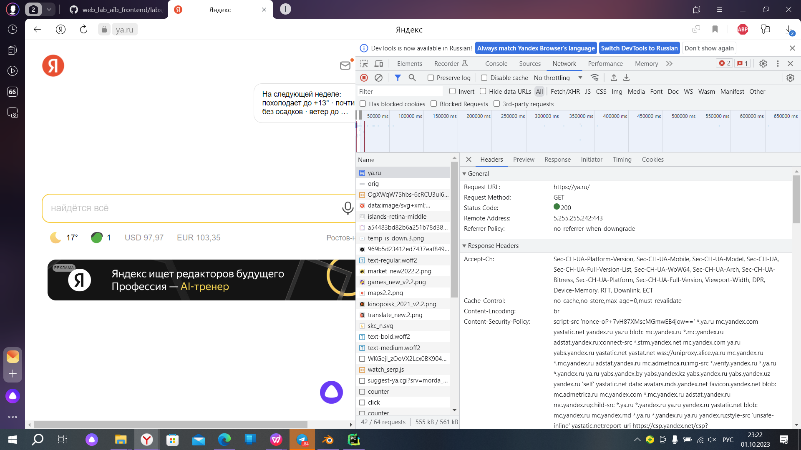
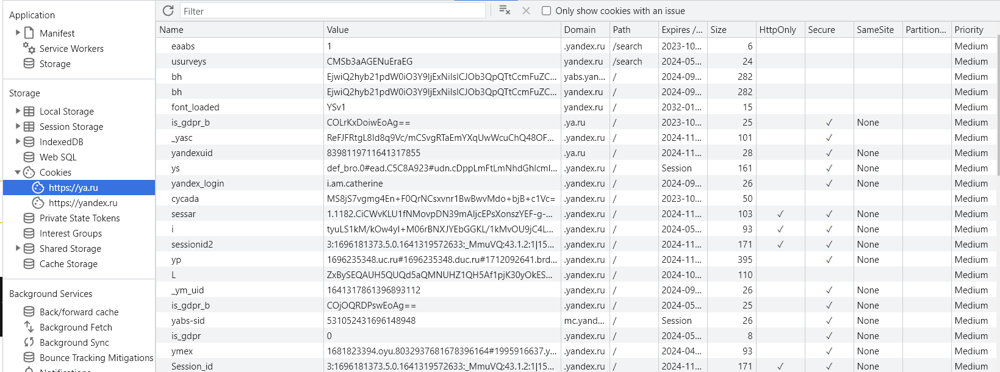
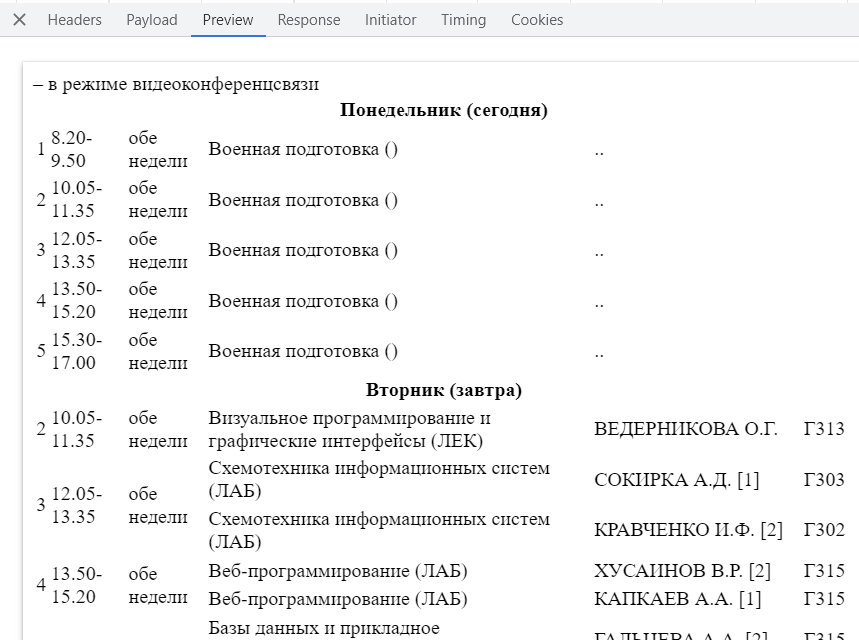
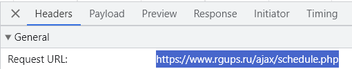
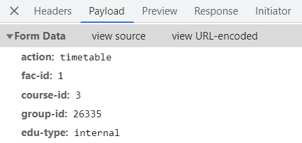
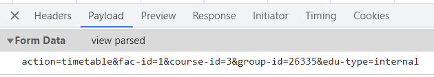

# Лабораторная работа №2.   
"Инструменты разработчика в браузере"  

Задание №1. Исследование заголовков и тела обычных запросов 
и их ответов.  

`Request URL` - https://ya.ru/ - это URL-адрес, на который был отправлен запрос  
`Request Method - GET 0` метод запроса, который указывает на то, что клиент запрашивает данные от сервера  
`Status Code - 200 `- код состояния ответа сервера, который указывает на успешное выполнение запроса  
`Remote Address - 77.88.55.242:443` - удаленный IP- адрес порт сервера, с которым установлено соединение  
`Referrer Policy - origin ` - политика относительно передачи информации о источнике запроса  
`content-type - text/html; charset=UTF-8 ` - контент ответа сервера  
`cache-control - no-cache,no-store,max-age=0,must-revalidate `-  указание серверу и клиенту о том, как кэшировать или не кэшировать ответ  
`cookie:`- небольшой фрагмент данных, который отправляется сервером и хранится на компьютере пользователя    

`user-agent` - Mozilla/5.0 (Windows NT 10.0; Win64; x64) AppleWebKit/537.36 (KHTML, like Gecko) Chrome/114.0.0.0 YaBrowser/23.7.5.704 Yowser/2.5 Safari/537.36 - содержит информацию о браузере и операционной системе пользователя   
`referer` - https://ya.ru/ - это URL-адрес страницы, с которой был отправлен запрос  

Задание №2. Исследование указывающих ответов сервера.  
При открытых во вкладке инструментах разработчика сделала запрос на http://rgups.ru/ и обратила внимание на то, что изменился адрес в адресной строке  
~~~
Был такой http://rgups.ru/
Стал такой https://rgups.ru/
Прибавилось окончание -s, так как перешли на защищенное соединение
~~~

Задание №3. Исследование получения и передачи cookie.  
Повторила запрос на https://ya.ru/ и изучила заголовки влияющие на получение и отправку cookie параметров.  
3.1)
1) yandex_login - логин в Яндексе  
2) font_loaded YSv1 - загруженные файлы в таком в значении YSv1  
3) yandexuid - уникальный идентификатор пользователя, который меняется при каждом входе пользователя.  

3.2) Для того, чтобы просмотреть все cookie необходимо открыть   
Откроется вкладка и я перехожу  https://ya.ru/  и перехожу на вкладку Network, чтобы посмотреть все cookie необходимо открыть вкладку Application   

3.2.1) Параметры cookie:  
Name - название cookie  
Value - значение, которое будет сохранено в cookie  
Domain - домен, на котором доступна cookie  
Path - пусть на сервере, для которого cookie доступна  
Expires - срок годности cookie, после истечения срока cookie булет удалена 
4)  cookie это информация о нас, то, что отправляется сервером нам на компьютера. Это логины, пароли, языковые настройки и прочее. Для того, чтобы не вводить одни и те же данные на каждом сервесе.  

Задание №4. Исследование построения документов и сопутствующих запросов.  
1) DOM - это способ представления HTML или XML документа в виде дерева объектов, где каждый элемент документа является узлом этого дерева. Это позволяет программно изменять и взаимодействовать с элементами документа, такими как добавление, удаление или изменение элементов, атрибутов или текстового содержимого. DOM также позволяет получать доступ к элементам документа и выполнять с ними различные операции с помощью JavaScript или других языков программирования.  
2) Да, итоговый документ может отличаться от тела ответа, полученного от сервера. Это может происходить по нескольким причинам:
2.1. JavaScript: Использование JavaScript на стороне клиента позволяет изменять и модифицировать содержимое страницы после загрузки. Например, с помощью JavaScript можно добавлять новые элементы, изменять атрибуты или текстовое содержимое элементов.
2.2. AJAX: Использование технологии AJAX позволяет загружать дополнительные данные с сервера без перезагрузки всей страницы. Это может привести к изменению содержимого страницы после ее первоначальной загрузки.  
2.3. Серверные скрипты: Некоторые серверные скрипты могут изменять содержимое страницы перед отправкой ее клиенту. Например, серверный скрипт может изменить значения атрибутов или вставить дополнительные элементы в документ перед его отправкой.  
2.4. Кэширование: Прокси-серверы или браузеры могут кэшировать предыдущие версии страницы и отдавать их вместо актуальной версии. В этом случае, итоговый документ будет отличаться от оригинального тела ответа.  
3) Если в списке запросов и ответов отображается большое количество записей, это может быть вызвано следующими причинами:  
1. Загрузка ресурсов: Когда вы делаете запрос к определенной странице, браузер может загружать дополнительные ресурсы, такие как изображения, стили CSS, скрипты JavaScript и другие файлы. Каждый из этих ресурсов будет отображаться в списке запросов и ответов.
2. AJAX-запросы: Если на странице используется технология AJAX, то браузер может отправлять дополнительные запросы на сервер для получения или отправки данных без перезагрузки всей страницы. Эти запросы и ответы также будут отображаться в списке.
3. Редиректы: Если сервер возвращает ответ с кодом перенаправления (например, 301 или 302), браузер автоматически перенаправляет запрос на другой URL. В этом случае, каждый запрос и ответ для каждого перенаправления будет отображаться в списке.
4. Кэширование: Браузер может кэшировать ресурсы и использовать их для последующих запросов. Если ресурс уже есть в кэше, браузер может использовать его без отправки запроса на сервер. В этом случае, запрос и ответ для кэшированного ресурса также могут отображаться в списке.  

Основание для того, чтобы браузер делал эти запросы и отображал их в списке, зависит от того, как веб-страница была разработана и какие ресурсы ей требуются. Например, браузер может делать запросы для загрузки изображений или стилей CSS, чтобы правильно отобразить страницу. AJAX-запросы могут быть использованы для динамического обновления содержимого страницы без перезагрузки. Кэширование позволяет браузеру сохранять копии ресурсов для повторного использования и ускорения загрузки страницы.  

Задание №5. Определение параметров запроса.  
1) Чтобы получить мое расписание, необходимо обратиться к эндпоинту    
2) Тело ответа состоит из кода, выдающего на экран мое расписание, код представлен ниже.  
   
3) Тип запроса    
4) Эти данные я использовала для получения моего расписания:  
   
   
   
Нажав на view sourсe открылось view pasted  
  
Соединив две ссылки, получилась ссылка на расписание:  
https://www.rgups.ru/ajax/schedule.php?action=timetable&fac-id=1&course-id=3&group-id=26335&edu-type=internal  

Код расписания:  
~~~

					
<i></i> – в режиме видеоконференцсвязи

    		
    <table class="table">             <tr>
                <th class=" info" colspan="6">
                    Понедельник (сегодня)                </th>
            </tr>
                      <tr>
                        <td class="" >1</td>
                        <td class="" >8.20-9.50</td>
                        <td class="" >обе недели</td>
                            <td class="">Военная подготовка ()</td>
                            <td class=""> ..</td>
                            <td class=""></td>
                    </tr>
                      <tr>
                        <td class="" >2</td>
                        <td class="" >10.05-11.35</td>
                        <td class="" >обе недели</td>
                            <td class="">Военная подготовка ()</td>
                            <td class=""> ..</td>
                            <td class=""></td>
                    </tr>
                      <tr>
                        <td class="success" >3</td>
                        <td class="success" >12.05-13.35</td>
                        <td class="success" >обе недели</td>
                            <td class="success">Военная подготовка ()</td>
                            <td class="success"> ..</td>
                            <td class="success"></td>
                    </tr>
                      <tr>
                        <td class="" >4</td>
                        <td class="" >13.50-15.20</td>
                        <td class="" >обе недели</td>
                            <td class="">Военная подготовка ()</td>
                            <td class=""> ..</td>
                            <td class=""></td>
                    </tr>
                      <tr>
                        <td class="" >5</td>
                        <td class="" >15.30-17.00</td>
                        <td class="" >обе недели</td>
                            <td class="">Военная подготовка ()</td>
                            <td class=""> ..</td>
                            <td class=""></td>
                    </tr>

            <tr>
                <th class="" colspan="6">
                    Вторник (завтра)                </th>
            </tr>
                      <tr>
                        <td class="" >2</td>
                        <td class="" >10.05-11.35</td>
                        <td class="" >обе недели</td>
                            <td class="">Визуальное программирование и графические интерфейсы (ЛЕК)</td>
                            <td class="">ВЕДЕРНИКОВА О.Г.</td>
                            <td class="">Г313</td>
                    </tr>
                      <tr>
                        <td class="" rowspan="2">3</td>
                        <td class="" rowspan="2">12.05-13.35</td>
                        <td class="" rowspan="2">обе недели</td>
                            <td class="">Схемотехника информационных систем (ЛАБ)</td>
                            <td class="">СОКИРКА А.Д. [1]</td>
                            <td class="">Г303</td>
</tr><tr>                            <td class="">Схемотехника информационных систем (ЛАБ)</td>
                            <td class="">КРАВЧЕНКО И.Ф. [2]</td>
                            <td class="">Г302</td>
</tr><tr>                    </tr>
                      <tr>
                        <td class="" rowspan="2">4</td>
                        <td class="" rowspan="2">13.50-15.20</td>
                        <td class="" rowspan="2">обе недели</td>
                            <td class="">Веб-программирование (ЛАБ)</td>
                            <td class="">ХУСАИНОВ В.Р. [2]</td>
                            <td class="">Г315</td>
</tr><tr>                            <td class="">Веб-программирование (ЛАБ)</td>
                            <td class="">КАПКАЕВ А.А. [1]</td>
                            <td class="">Г315</td>
</tr><tr>                    </tr>
                      <tr>
                        <td class="" rowspan="2">5</td>
                        <td class="" rowspan="2">15.30-17.00</td>
                        <td class="" rowspan="2">обе недели</td>
                            <td class="">Базы данных и прикладное программирование (ЛАБ)</td>
                            <td class="">ГАЛЬЦЕВА А.А. [2]</td>
                            <td class="">Г315</td>
</tr><tr>                            <td class="">Базы данных и прикладное программирование (ЛАБ)</td>
                            <td class="">ЗЫРЯНКИНА К.Э. [1]</td>
                            <td class="">Г315</td>
</tr><tr>                    </tr>

            <tr>
                <th class="" colspan="6">
                    Среда                </th>
            </tr>
                      <tr>
                        <td class="" rowspan="2">1</td>
                        <td class="" rowspan="2">8.20-9.50</td>
                        <td class="" rowspan="2">обе недели</td>
                            <td class="">Визуальное программирование и графические интерфейсы (ЛАБ)</td>
                            <td class="">ВЕДЕРНИКОВА О.Г. [1]</td>
                            <td class="">Д407</td>
</tr><tr>                            <td class="">Визуальное программирование и графические интерфейсы (ЛАБ)</td>
                            <td class="">ОЛЬГЕЙЗЕР И.А. [2]</td>
                            <td class="">Д410</td>
</tr><tr>                    </tr>
                      <tr>
                        <td class="" >2</td>
                        <td class="" >10.05-11.35</td>
                        <td class="" >обе недели</td>
                            <td class="">Экономика и менеджмент (ПРАК)</td>
                            <td class="">ТИМЧЕНКО О.В.</td>
                            <td class="">А420</td>
                    </tr>
                      <tr>
                        <td class="" >3</td>
                        <td class="" >12.05-13.35</td>
                        <td class="" >обе недели</td>
                            <td class="">Базы данных и прикладное программирование (ЛЕК)</td>
                            <td class="">ИГНАТЬЕВА О.В.</td>
                            <td class="">Г313</td>
                    </tr>
                      <tr>
                        <td class="" >4</td>
                        <td class="" >13.50-15.20</td>
                        <td class="" >обе недели</td>
                            <td class="">Схемотехника информационных систем (ЛЕК)</td>
                            <td class="">ЛЯЩЕНКО А.М.</td>
                            <td class="">Г313</td>
                    </tr>

            <tr>
                <th class="" colspan="6">
                    Четверг                </th>
            </tr>
<!--2-->                      <tr>
                        <td class="" rowspan="2">1</td>
                        <td class="" rowspan="2">8.20-9.50</td>
                        <td class="disable " >над чертой</td>
                              
                            <td class="disable ">&#151;</td>
                            <td class=""><!--  --></td>
                            <td class=""><!--  --></td>
                        </tr>
                        <tr>
                            <td class=" " >под чертой</td>
                                <td class=" ">Системное программное обеспечение информационных систем (ЛАБ)</td>
                                <td class=" ">ВОЛКОВ-ГОНЧАРОВ Н.А. [1]</td>
                                <td class=" ">Д407</td>
                          </tr>
                                       </tr>
                      <tr>
                        <td class="" >2</td>
                        <td class="" >10.05-11.35</td>
                        <td class="" >обе недели</td>
                            <td class="">Экономика и менеджмент (ЛЕК)</td>
                            <td class="">КАЛАШНИКОВ И.А.</td>
                            <td class="">С204</td>
                    </tr>
<!--4-->                      <tr>
                        <td class="" rowspan="4">3</td>
                        <td class="" rowspan="4">12.05-13.35</td>
                        <td class="disable " >над чертой</td>
                                  
                                <td class="disable ">Безопасность жизнедеятельности (ЛЕК)</td>
                                <td class="disable ">ПЕРЕВЕРЗЕВ И.Г.</td>
                                <td class="disable ">М215</td>
                        </tr>
                        <tr>
                            <td class=" " rowspan="3">под чертой</td>
                                <td class=" ">Безопасность жизнедеятельности (ЛАБ)</td>
                                <td class=" ">ЯИЦКОВА Н.М. [1]</td>
                                <td class=" ">М153</td>
</tr><tr>                                <td class=" ">Безопасность жизнедеятельности (ЛАБ)</td>
                                <td class=" ">ВОРОБИНСКАЯ Л.И. [2]</td>
                                <td class=" ">М156</td>
</tr><tr>                          </tr>
                                       </tr>
<!--2-->                      <tr>
                        <td class="" rowspan="2">4</td>
                        <td class="" rowspan="2">13.50-15.20</td>
                        <td class="disable " >над чертой</td>
                                  
                                <td class="disable ">Безопасность жизнедеятельности (ПРАК)</td>
                                <td class="disable ">ПЕРЕВЕРЗЕВ И.Г.</td>
                                <td class="disable ">М231</td>
                        </tr>
                        <tr>
                            <td class=" " >под чертой</td>
                            <td class=" ">&#151;</td>
                            <td class=""><!--  --></td>
                            <td class=""><!--  --></td>
                          </tr>
                                       </tr>

            <tr>
                <th class="" colspan="6">
                    Пятница                </th>
            </tr>
                      <tr>
                        <td class="" rowspan="2">1</td>
                        <td class="" rowspan="2">8.20-9.50</td>
                        <td class="disable " >над чертой</td>
                                  
                                <td class="disable ">Системное программное обеспечение информационных систем (ПРАК)</td>
                                <td class="disable ">ЖУКОВ В.В.</td>
                                <td class="disable ">Д407</td>
                        </tr>
                        <tr>
                            <td class=" " >под чертой</td>
                                <td class=" ">Системное программное обеспечение информационных систем (ЛАБ)</td>
                                <td class=" ">НИКИТЧЕНКО С.Л. [2]</td>
                                <td class=" ">Д406</td>
                          </tr>
                                       </tr>
                      <tr>
                        <td class="" >2</td>
                        <td class="" >10.05-11.35</td>
                        <td class="" >обе недели</td>
                            <td class="">Системное программное обеспечение информационных систем (ЛЕК)</td>
                            <td class="">ЖУКОВ В.В.</td>
                            <td class="">Г313</td>
                    </tr>
                      <tr>
                        <td class="" >3</td>
                        <td class="" >12.05-13.35</td>
                        <td class="" >обе недели</td>
                            <td class="">Веб-программирование (ЛЕК)</td>
                            <td class="">КАПКАЕВ А.А.</td>
                            <td class="">Г313</td>
                    </tr>

</table>

~~~